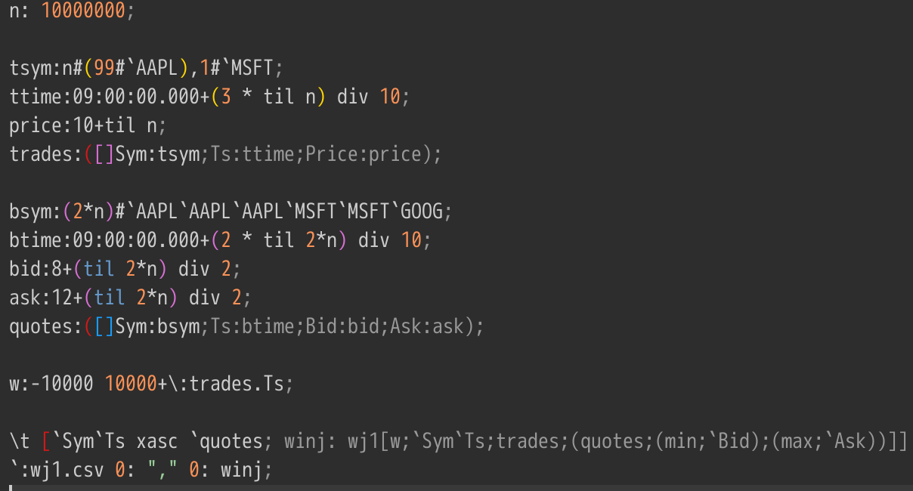

# :material-speedometer: DB(s) Benchmark

For benches we are using the following tool:
[H2OAI Bench](https://h2oai.github.io/db-benchmark)

<script src="https://cdn.jsdelivr.net/npm/echarts@5.4.3/dist/echarts.min.js"></script>

<style>
tr:has(td:first-child:contains("Rayforce")),
table tbody tr:nth-child(5) {
  background-color: rgba(21, 101, 192, 0.15) !important;
}
</style>

<script>
document.addEventListener('DOMContentLoaded', function() {
  document.querySelectorAll('table tbody tr').forEach(function(row) {
    if (row.cells[0] && row.cells[0].textContent.trim() === 'Rayforce') {
      row.style.backgroundColor = 'rgba(21, 101, 192, 0.15)';
      row.style.fontWeight = '500';
    }
  });
});
</script>

??? info "Prerequisites"

    Ubuntu:

    ```sh
    sudo apt install r-base
    ```

    Run `R` and then in a R console type:

    ```sh
    install.packages("data.table")
    ```

    Exit from R and type in a terminal:

    ```sh
    Rscript _data/groupby-datagen.R 1e7 1e2 0 0
    ```

---

## Group By Results

<div id="groupby-chart" style="width: 100%; height: 500px;"></div>

<script>
document.addEventListener('DOMContentLoaded', function() {
  var chart = echarts.init(document.getElementById('groupby-chart'));
  var pale = { opacity: 0.35 };
  chart.setOption({
    title: { text: 'Group By Benchmark (lower is better)', left: 'center' },
    tooltip: { trigger: 'axis', axisPointer: { type: 'shadow' } },
    legend: { top: 30, data: ['DuckDB (MT on)', 'DuckDB (MT off)', 'ClickHouse', '? (4.0)', 'Rayforce', 'ThePlatform'] },
    grid: { left: '3%', right: '4%', bottom: '3%', top: 80, containLabel: true },
    xAxis: { type: 'category', data: ['Q1', 'Q2', 'Q3', 'Q4', 'Q5', 'Q6', 'Q7'] },
    yAxis: { type: 'log', name: 'Time (ms)' },
    series: [
      { name: 'DuckDB (MT on)', type: 'bar', data: [63, 153, 360, 23, 322, 330, 878], itemStyle: pale },
      { name: 'DuckDB (MT off)', type: 'bar', data: [347, 690, 601, 108, 440, 528, 3269], itemStyle: pale },
      { name: 'ClickHouse', type: 'bar', data: [51, 189, 235, 47, 265, 249, 1732], itemStyle: pale },
      { name: '? (4.0)', type: 'bar', data: [59, 143, 166, 99, 156, 551, 4497], itemStyle: pale },
      { name: 'Rayforce', type: 'bar', data: [60, 74, 118, 72, 122, 104, 1394], itemStyle: { color: '#1565C0' } },
      { name: 'ThePlatform', type: 'bar', data: [213, 723, 507, 285, 488, 465, 15712], itemStyle: pale }
    ]
  });
  window.addEventListener('resize', function() { chart.resize(); });
});
</script>

**Legend:** Q1-Q7 = Query 1 through Query 7. Lower values (ms) are better.

| DB                              | Q1  | Q2  | Q3  | Q4  | Q5  | Q6  | Q7    |
| ------------------------------- | --- | --- | --- | --- | --- | --- | ----- |
| DuckDB (multithread turned on)  | 63  | 153 | 360 | 23  | 322 | 330 | 878   |
| DuckDB (multithread turned off) | 347 | 690 | 601 | 108 | 440 | 528 | 3269  |
| ClickHouse                      | 51  | 189 | 235 | 47  | 265 | 249 | 1732  |
| ? (4.0)                         | 59  | 143 | 166 | 99  | 156 | 551 | 4497  |
| Rayforce                        | 60  | 74  | 118 | 72  | 122 | 104 | 1394  |
| ThePlatform                     | 213 | 723 | 507 | 285 | 488 | 465 | 15712 |

??? note "Group By Benchmark Details"

    Dataset: G1_1e7_1e2_0_0.csv (10 million rows)

    ??? example "DuckDB (multithread turned on)"

        ```.timer "on"```

        Load CSV: ```create table t as SELECT * FROM read_csv('./db-benchmark/G1_1e7_1e2_0_0.csv');```

        **Q1** (63ms)
        ```sql
        select id1, sum(v1) AS v1 from t group by id1;
        ```

        **Q2** (153ms)
        ```sql
        select id1, id2, sum(v1) AS v1 from t group by id1, id2;
        ```

        **Q3** (360ms)
        ```sql
        select id3, sum(v1) AS v1, mean(v3) AS v3 from t group by id3;
        ```

        **Q4** (23ms)
        ```sql
        select id4, mean(v1) AS v1, mean(v2) AS v2, mean(v3) AS v3 from t group by id4;
        ```

        **Q5** (322ms)
        ```sql
        select id6, sum(v1) AS v1, sum(v2) AS v2, sum(v3) AS v3 from t group by id6;
        ```

        **Q6** (330ms)
        ```sql
        select id3, max(v1)-min(v2) AS range_v1_v2 from t group by id3;
        ```

        **Q7** (878ms)
        ```sql
        select id1, id2, id3, id4, id5, id6, sum(v3) AS v3, count(*) AS count from t group by id1, id2, id3, id4, id5, id6;
        ```

    ??? example "DuckDB (multithread turned off)"

        ```.timer "on"```
        ```SET threads = 1;```

        Load CSV: ```create table t as SELECT * FROM read_csv('./db-benchmark/G1_1e7_1e2_0_0.csv');```

        **Q1** (347ms)
        ```sql
        select id1, sum(v1) AS v1 from t group by id1;
        ```

        **Q2** (690ms)
        ```sql
        select id1, id2, sum(v1) AS v1 from t group by id1, id2;
        ```

        **Q3** (601ms)
        ```sql
        select id3, sum(v1) AS v1, mean(v3) AS v3 from t group by id3;
        ```

        **Q4** (108ms)
        ```sql
        select id4, mean(v1) AS v1, mean(v2) AS v2, mean(v3) AS v3 from t group by id4;
        ```

        **Q5** (440ms)
        ```sql
        select id6, sum(v1) AS v1, sum(v2) AS v2, sum(v3) AS v3 from t group by id6;
        ```

        **Q6** (528ms)
        ```sql
        select id3, max(v1)-min(v2) AS range_v1_v2 from t group by id3;
        ```

        **Q7** (3269ms)
        ```sql
        select id1, id2, id3, id4, id5, id6, sum(v3) AS v3, count(*) AS count from t group by id1, id2, id3, id4, id5, id6;
        ```

    ??? example "ClickHouse"

        Load CSV: ```CREATE TABLE t (id1 String, id2 String, id3 String, id4 Int64, id5 Int64, id6 Int64, v1 Int64, v2 Int64, v3 Float64) ENGINE = Memory;```

        ```sh
        clickhouse-client -q "INSERT INTO default.t FORMAT CSV" < ./db-benchmark/G1_1e7_1e2_0_0.csv
        ```

        **Q1** (51ms)
        ```sql
        select id1, sum(v1) AS v1 from t group by id1;
        ```

        **Q2** (189ms)
        ```sql
        select id1, id2, sum(v1) AS v1 from t group by id1, id2;
        ```

        **Q3** (235ms)
        ```sql
        select id3, sum(v1) AS v1, avg(v3) AS v3 from t group by id3;
        ```

        **Q4** (47ms)
        ```sql
        select id4, avg(v1) AS v1, avg(v2) AS v2, avg(v3) AS v3 from t group by id4;
        ```

        **Q5** (265ms)
        ```sql
        select id6, sum(v1) AS v1, sum(v2) AS v2, sum(v3) AS v3 from t group by id6;
        ```

        **Q6** (249ms)
        ```sql
        select id3, max(v1)-min(v2) AS range_v1_v2 from t group by id3;
        ```

        **Q7** (1732ms)
        ```sql
        select id1, id2, id3, id4, id5, id6, sum(v3) AS v3, count(*) AS count from t group by id1, id2, id3, id4, id5, id6;
        ```

    ??? example "? (4.0)"

        Load CSV: ```t: ("SSSJJJJJF";enlist",") 0: hsym `$":./db-benchmark/G1_1e7_1e2_0_0.csv"```

        **Q1** (59ms)
        ```q
        select v1: sum v1 by id1 from t
        ```

        **Q2** (143ms)
        ```q
        select v1: sum v1 by id1, id2 from t
        ```

        **Q3** (166ms)
        ```q
        select v1: sum v1, v3: avg v3 by id3 from t
        ```

        **Q4** (99ms)
        ```q
        select v1: avg v1, v2: avg v2, v3: avg v3 by id4 from t
        ```

        **Q5** (156ms)
        ```q
        select v1: sum v1, v2: sum v2, v3: sum v3 by id6 from t
        ```

        **Q6** (551ms)
        ```q
        select range_v1_v2: (max v1) - (min v2) by id3 from t
        ```

        **Q7** (4497ms)
        ```q
        select v3: sum v3, cnt: count i by id1, id2, id3, id4, id5, id6 from t
        ```

    ??? example "Rayforce"

        Load CSV: ```(set t (csv [Symbol Symbol Symbol I64 I64 I64 I64 I64 F64] "./db-benchmark/G1_1e7_1e2_0_0.csv"))```

        **Q1** (60ms)
        ```lisp
        (timeit (select {v1: (sum v1) from: t by: id1}))
        ```

        **Q2** (74ms)
        ```lisp
        (timeit (select {v1: (sum v1) from: t by: {id1: id1 id2: id2}}))
        ```

        **Q3** (118ms)
        ```lisp
        (timeit (select {v1: (sum v1) v3: (avg v3) from: t by: id3}))
        ```

        **Q4** (72ms)
        ```lisp
        (timeit (select {v1: (avg v1) v2: (avg v2) v3: (avg v3) from: t by: id4}))
        ```

        **Q5** (122ms)
        ```lisp
        (timeit (select {v1: (sum v1) v2: (sum v2) v3: (sum v3) from: t by: id6}))
        ```

        **Q6** (104ms)
        ```lisp
        (timeit (select {range_v1_v2: (- (max v1) (min v2)) from: t by: id3}))
        ```

        **Q7** (1394ms)
        ```lisp
        (timeit (select {v3: (sum v3) count: (map count v3) from: t by: {id1: id1 id2: id2 id3: id3 id4: id4 id5: id5 id6: id6}}))
        ```

    ??? example "ThePlatform"

        Load CSV: ```t: ("SSSJJJJJF";enlist",") 0: `$":./db-benchmark/G1_1e7_1e2_0_0.csv"```

        **Q1** (213ms)
        ```q
        0N#.?[t;();`id1!`id1;`v1!(sum;`v1)]
        ```

        **Q2** (723ms)
        ```q
        0N#.?[t;();`id1`id2!`id1`id2;`v1!(sum;`v1)]
        ```

        **Q3** (507ms)
        ```q
        0N#.?[t;();`id3!`id3;`v2`v3!((sum;`v2);(avg;`v3))]
        ```

        **Q4** (285ms)
        ```q
        0N#.?[t;();`id4!`id4;`v1`v2`v3!((avg;`v1);(avg;`v2);(avg;`v3))]
        ```

        **Q5** (488ms)
        ```q
        0N#.?[t;();`id6!`id6;`v1`v2`v3!((sum;`v1);(sum;`v2);(sum;`v3))]
        ```

        **Q6** (465ms)
        ```q
        0N#.?[?[t;();`id3!`id3;`v1`v2!((max;`v1);(min;`v2))];();0b;`id3`range_v1_v2!(`id3;(-;`v1;`v2))]
        ```

        **Q7** (15712ms)
        ```q
        0N#.?[t;();`id1`id2`id3`id4`id5`id6!`id1`id2`id3`id4`id5`id6;`v3`count!((sum;`v3);(count;`v3))]
        ```

---

## Join Results

<div id="join-chart" style="width: 100%; height: 400px;"></div>

<script>
document.addEventListener('DOMContentLoaded', function() {
  var chart = echarts.init(document.getElementById('join-chart'));
  var pale = { opacity: 0.35 };
  chart.setOption({
    title: { text: 'Join Benchmark (lower is better)', left: 'center' },
    tooltip: { trigger: 'axis', axisPointer: { type: 'shadow' } },
    legend: { top: 30, data: ['? (4.0)', 'Rayforce', 'ThePlatform'] },
    grid: { left: '3%', right: '4%', bottom: '3%', top: 80, containLabel: true },
    xAxis: { type: 'category', data: ['Q1 (Left Join)', 'Q2 (Inner Join)'] },
    yAxis: { type: 'log', name: 'Time (ms)' },
    series: [
      { name: '? (4.0)', type: 'bar', data: [3174, 3098], itemStyle: pale },
      { name: 'Rayforce', type: 'bar', data: [3149, 1610], itemStyle: { color: '#1565C0' } },
      { name: 'ThePlatform', type: 'bar', data: [23987, 34104], itemStyle: pale }
    ]
  });
  window.addEventListener('resize', function() { chart.resize(); });
});
</script>

**Legend:** Q1 = Left Join, Q2 = Inner Join. OOM = Out of Memory. Lower values (ms) are better.

| DB                              | Q1    | Q2    |
| ------------------------------- | ----- | ----- |
| DuckDB (multithread turned on)  | OOM   | OOM   |
| DuckDB (multithread turned off) | OOM   | OOM   |
| ClickHouse                      | OOM   | OOM   |
| ? (4.0)                         | 3174  | 3098  |
| Rayforce                        | 3149  | 1610  |
| ThePlatform                     | 23987 | 34104 |

??? note "Join Benchmark Details"

    Data generation:
    ```sh
    Rscript _data/join-datagen.R 1e7 1e2 0 0
    ```

    ??? example "DuckDB (multithread turned on)"

        ```.timer "on"```

        Load CSV:

        - x: ```create table x as SELECT * FROM read_csv('./db-benchmark/J1_1e7_NA_0_0.csv');```
        - y: ```create table y as SELECT * FROM read_csv('./db-benchmark/J1_1e7_1e7_0_0.csv');```

        **Q1** (OOM)
        ```sql
        select * from x left join y on x.id1 = y.id1 and x.id2 = y.id2;
        ```

        **Q2** (OOM)
        ```sql
        select * from x inner join y on x.id1 = y.id1 and x.id2 = y.id2;
        ```

    ??? example "DuckDB (multithread turned off)"

        ```.timer "on"```
        ```SET threads = 1;```

        **Q1** (OOM)
        ```sql
        select * from x left join y on x.id1 = y.id1 and x.id2 = y.id2;
        ```

        **Q2** (OOM)
        ```sql
        select * from x inner join y on x.id1 = y.id1 and x.id2 = y.id2;
        ```

    ??? example "ClickHouse"

        Load CSV:

        - ```CREATE TABLE x (id1 Int64, id2 Int64, id3 Int64, id4 String, id5 String, id6 String, v1 Float64) ENGINE = Memory;```
        - ```CREATE TABLE y (id1 Int64, id2 Int64, id3 Int64, id4 String, id5 String, id6 String, v2 Float64) ENGINE = Memory;```

        ```sh
        clickhouse-client -q "INSERT INTO default.x FORMAT CSV" < ./db-benchmark/J1_1e7_NA_0_0.csv
        clickhouse-client -q "INSERT INTO default.y FORMAT CSV" < ./db-benchmark/J1_1e7_1e7_0_0.csv
        ```

        **Q1** (OOM)
        ```sql
        select * from x left join y on x.id1 = y.id1 and x.id2 = y.id2;
        ```

        **Q2** (OOM)
        ```sql
        select * from x inner join y on x.id1 = y.id1 and x.id2 = y.id2;
        ```

    ??? example "? (4.0)"

        Load CSV:

        - x: ```("JJJSSSF";enlist",") 0: `$":./db-benchmark/J1_1e7_NA_0_0.csv"```
        - y: ```("JJJSSSF";enlist",") 0: `$":./db-benchmark/J1_1e7_1e7_0_0.csv"```

        **Q1** (3174ms)
        ```q
        x lj 2!y
        ```

        **Q2** (3098ms)
        ```q
        x ij 2!y
        ```

    ??? example "Rayforce"

        Load CSV:

        - ```(set x (csv [I64 I64 I64 Symbol Symbol Symbol F64] "./db-benchmark/J1_1e7_NA_0_0.csv"))```
        - ```(set y (csv [I64 I64 I64 Symbol Symbol Symbol F64] "./db-benchmark/J1_1e7_1e7_0_0.csv"))```

        **Q1** (3149ms)
        ```lisp
        (timeit (lj [id1 id2] x y))
        ```

        **Q2** (1610ms)
        ```lisp
        (timeit (ij [id1 id2] x y))
        ```

    ??? example "ThePlatform"

        Load CSV:

        - x: ```("JJJSSSF";enlist",") 0: `$":./db-benchmark/J1_1e7_NA_0_0.csv"```
        - y: ```("JJJSSSF";enlist",") 0: `$":./db-benchmark/J1_1e7_1e7_0_0.csv"```

        **Q1** (23987ms)
        ```q
        0N#.(?[lj[(`x;x);(`y;y);((~`x`id1;~`x`id2);(~`y`id1;~`y`id2))]; (); 0b; `a`b`c`d`e`f`g`h!(~`y`id1;~`y`id2;`y`id3;~`y`id4;~`y`id5;~`y`id6;~`x`v1;~`y`v2)])
        ```

        **Q2** (34104ms)
        ```q
        0N#.(?[ij[(`x;x);(`y;y);((~`x`id1;~`x`id2);(~`y`id1;~`y`id2))]; (); 0b; `a`b`c`d`e`f`g`h!(~`y`id1;~`y`id2;`y`id3;~`y`id4;~`y`id5;~`y`id6;~`x`v1;~`y`v2)])
        ```

---

## Window Join Results

**Legend:** Q1 = Window Join query. Lower values are better.

| DB                              | Q1    |
| ------------------------------- | ----- |
| ? (4.0)                         | ~33 min |
| Rayforce                        | 59145.60 ms |

??? note "Window Join Benchmark Details"

    ??? example "? (4.0)"

        

    ??? example "Rayforce"

        
